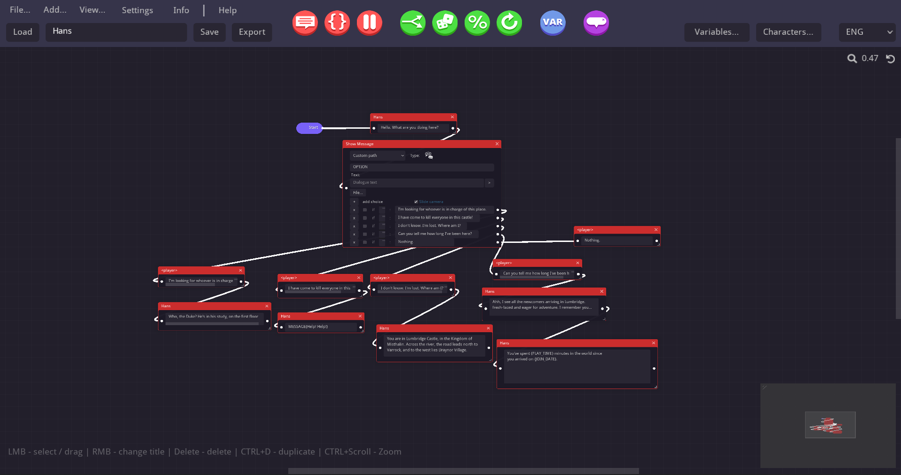
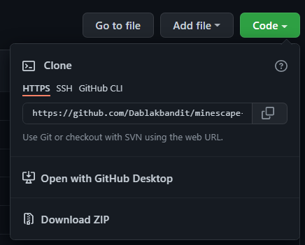
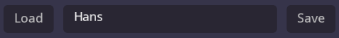
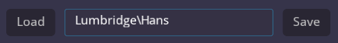
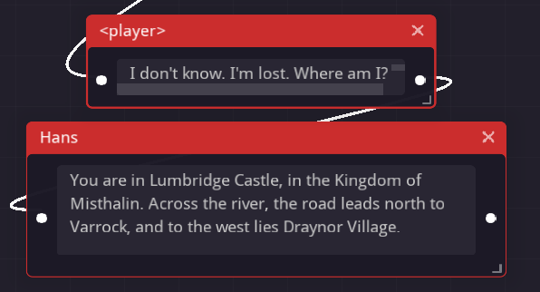
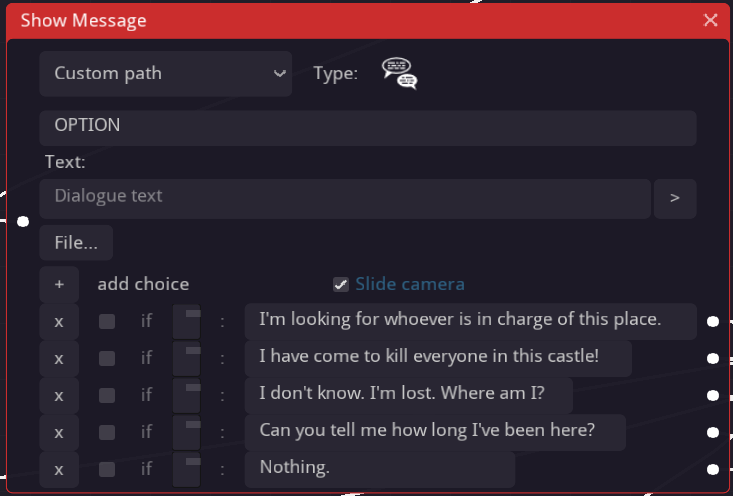
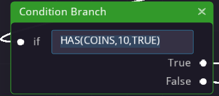
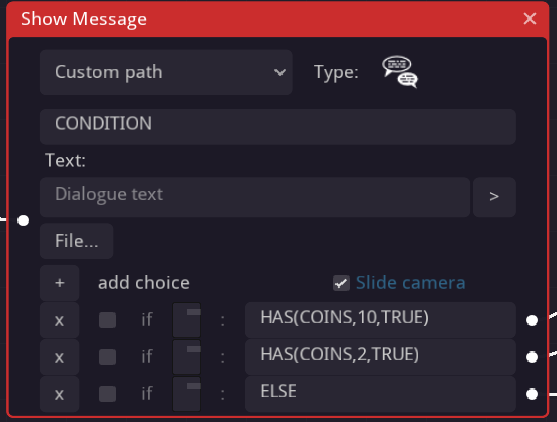
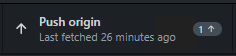

# **MineScape® Dialogue Creator**

Repository setup for dialogue of NPC's on the [MineScape](https://minescape.me)® Minecraft server.

## Installation

### Software

Requires purchase/download of the following software (also available on steam):
[https://radmatt.itch.io/dialogue-designer](https://radmatt.itch.io/dialogue-designerhttps:/)

GitHub Desktop & Github Account:
[https://desktop.github.com/](https://desktop.github.com/)
[https://github.com/join](https://github.com/join)

1. From [https://github.com/Dablakbandit/minescape-dialogue](https://github.com/Dablakbandit/minescape-dialogue) click the green 'Code' button.
2. Click 'Open with GitHub Desktop' and accept the popup if it appears.
3. Select a folder to clone the repository to ie (C:\Users\You\Documents\minescape-dialogue)

1. Open dialogue designer
2. Select settings from the top menu
3. Click the change button next to Project folder and select the folder where the dialogue is located ie (C:\Users\You\Documents\minescape-dialogue\dialogue)

## Contributing

To contribute you can either edit an existing dialogue or add your own.

### Notes:

* **You must add the npc to its relevant region folder or create one if it does not exist.**
* **When loading an existing dialogue, the path is not automatically inserted into the box, you must add it.**

  ***Issue:*** 

  ***Fix:***   
* **You can utilize 'ctrl + d' to duplicate boxes, this can be very useful for player & dialogue boxes!**
* **Middle mouse click to scroll around the board.**
* **Any dialogue flow (white dots) that do not connect to another box are treated as the interface closing.**

### Dialogue

 **Dialogues are done using execute.**

1. Right click the box and rename it to either '\<player\>' or the NPC name ie 'Hans'.
   * *For empty titled dialogues use 'EMPTY'*
2. Enter the NPC text into the box as it shows in OSRS, using enter for new lines.
3. Resize the box show all the text shows.
   * *Some dialogues require custom variables, please include these in the message for your pull request (explained later).*
4. Add the dialogue flow by clicking one of the white circles and linking it to the another box.
   * *It can be tricky to get the lines to link with the circles, you can scroll in/out whilst attempting to connect to fix the issue.*

### Option

 **Options are made with show message.**

1. Select 'Custom path' from the first drop down.
2. Enter 'OPTION' into the object path.
3. Click the '+' button to add options.
4. Enter the options into the appropriate boxes.
   * *Conditions will later be supported (explained in the next section) for option dialogues.*
5. Add dialogue flow as necessary.

### Condition

**Conditions can be dificult if more than one condition needs to be considered.**
 **Use condition branch for single checks**

1. Enter the condition ie 'HAS(COINS,10,TRUE)' (conditions explained in the trello)
2. Add dialogue flows as necessary.

 **Use show message for multi conditions.**

1. Select 'Custom path' from the first drop down.
2. Enter 'CONDITION' into the object path.
3. Click the '+' button to add conditions.
4. Add the condition directly into the text box

   * *Make sure to order the conditions correctly, think about the flow of checks.*
   * *Don't enable condition as this box doesn't scale with the width of the text.*
5. Add 'ELSE' as the last option to be followed if all other checks fail

## Pull Requests

After adding your NPC dialogue to the correct region folder you can use GitHub Desktop to create a commit.

1. Add a summary for the commit ie 'Add Lumbridge Han'
2. Add a message (optional)
3. Press the commit button
4. Use the push origin button

   * *If you are not a contributer of the repository this may prompt you to make a fork. Click 'Fork this repository'

5. From the branch drop down, select create pull request

   * *This will take you to the github website where you can attempt to pull request to the main repository*

## Copyright:

No license, copyright of the Ashley Thew for MineScape Ltd NZ usage only.
Commercial usage not permitted.
